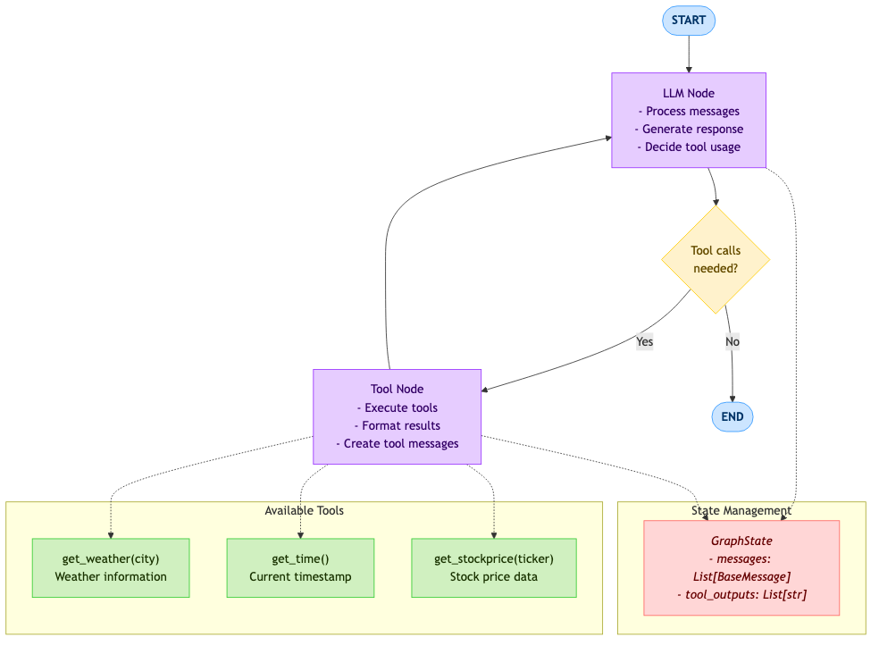

# LangGraph 函数调用智能体

[English Version](README.md)

一个使用 LangGraph 构建的对话式 AI 智能体，演示了函数调用（Function Calling）能力。智能体可以执行各种工具，同时保持对话的连贯性。

## 特性

- **函数调用**: 将外部工具与对话式 AI 无缝集成
- **多种工具**: 天气查询、时间获取、股价查询
- **状态管理**: 使用 LangGraph 的 StateGraph 实现健壮的对话流
- **条件逻辑**: 在对话和工具执行之间进行智能路由
- **人格模式**: 可选的斯内普教授人格，用于有趣的交互
- **DeepSeek 集成**: 使用 DeepSeek API 提供强大支持

## 架构

智能体遵循基于图的架构，包含两个主要节点：

<div align="center">
  
</div>

### 组件

1. **GraphState**: Pydantic 模型，管理对话状态和工具输出
2. **Tools**: 三个内置工具，用于天气、时间和股价查询
3. **LLM 节点**: 处理对话并决定何时使用工具
4. **Tool 节点**: 执行选定的工具并格式化响应
5. **条件路由器**: 判断是否需要执行工具

## 可用工具

### 天气工具
```python
@tool
def get_weather(city: str) -> str:
    """查询指定城市的天气"""
```

### 时间工具
```python
@tool
def get_time() -> str:
    """获取当前时间"""
```

### 股价工具
```python
@tool
def get_stockprice(ticker: str) -> str:
    """查询指定公司的股票价格"""
```

## 前置要求

- Python 3.8+
- DeepSeek API 访问权限
- 所需环境变量已设置

## 安装

1. 安装所需依赖：
```bash
pip install langgraph langchain-openai pydantic
```

2. 设置环境变量：
```bash
export DEEPSEEK_API_KEY="your_deepseek_api_key"
```

## 使用方式

### 基本用法

```python
from test_langgraph import graph, GraphState
from langchain_core.messages import HumanMessage, SystemMessage

# 创建初始状态
system_prompt = SystemMessage(content="你是一个有帮助的助手。")
user_query = HumanMessage(content="北京的天气怎么样？")
initial_state = GraphState(messages=[system_prompt, user_query])

# 运行智能体
final_state = graph.invoke(initial_state)

# 显示结果
for msg in final_state["messages"]:
    if isinstance(msg, AIMessage) and msg.content:
        print(f"AI: {msg.content}")
```

### 示例交互

**多工具查询：**
```
用户: "杭州的天气怎么样？现在几点了？阿里巴巴的股价是多少？"

智能体：
1. 执行 get_weather("杭州")
2. 执行 get_time()
3. 执行 get_stockprice("ALIBABA")
4. 提供包含所有信息的综合回复
```

**斯内普教授模式：**
```python
system_prompt = SystemMessage(content="""
你是一个有帮助的助手。在需要时使用工具。
你会用像《哈利·波特》中斯内普教授一样的语气回答问题，
并把用户当成哈利·波特。当你使用工具时，不需要使用这种语气。
""")
```

## 配置

### 模型配置
```python
llm = ChatOpenAI(
    base_url="https://api.deepseek.com/v1",
    api_key=DEEPSEEK_API_KEY,
    model="deepseek-chat",  # 可更换为其他模型
).bind_tools(tools)
```

### 添加自定义工具

要添加新工具，请遵循以下模式：

```python
@tool
def your_custom_tool(parameter: str) -> str:
    """
    描述你的工具做什么
    """
    # 你的工具逻辑在这里
    return "工具结果"

# 添加到工具列表
tools.append(your_custom_tool)
tool_map[your_custom_tool.name] = your_custom_tool
```

## 图结构

智能体使用 LangGraph 的 StateGraph，结构如下：

```python
builder = StateGraph(GraphState)
builder.add_node("llm", run_llm)
builder.add_node("call_tool", call_tool)
builder.add_edge(START, "llm")
builder.add_conditional_edges("llm", check_tool_use_needed, {
    "call_tool": "call_tool",
    "end": END
})
builder.add_edge("call_tool", "llm")
```

## 状态管理

`GraphState` 类管理：
- **messages**: 带有自动消息聚合的对话历史
- **tool_outputs**: 工具执行结果列表

```python
class GraphState(BaseModel):
    messages: Annotated[List[BaseMessage], add_messages]
    tool_outputs: List[str] = Field(default_factory=list)
```

## 错误处理

智能体包含基本的错误处理：
- 执行前的工具验证
- 未知工具的正确错误信息
- 状态一致性维护

## 扩展智能体

### 添加新节点
```python
def your_custom_node(state: GraphState) -> dict:
    # 你的自定义逻辑
    return {"messages": [new_message]}

builder.add_node("custom_node", your_custom_node)
```

### 修改条件逻辑
```python
def your_custom_router(state: GraphState) -> str:
    # 你的路由逻辑
    return "next_node_name"

builder.add_conditional_edges("source_node", your_custom_router, {
    "option1": "node1",
    "option2": "node2"
})
```

## 故障排除

### 常见问题

1. **API Key 错误**: 确保 `DEEPSEEK_API_KEY` 环境变量已设置
2. **工具未找到**: 检查 `tool_map` 中的工具注册
3. **状态问题**: 验证 `GraphState` 模型的兼容性

### 调试模式

通过检查打印的工具执行消息来启用调试输出：
```python
print(f"正在执行工具: {tool_name}")  # 工具执行日志
```

## 贡献

为这个项目做出贡献：

1. Fork 仓库
2. 添加新工具或功能
3. 确保适当的错误处理
4. 更新文档
5. 提交 pull request

## 许可证

本项目按原样提供，用于教育和开发目的。

## 致谢

- 使用 [LangGraph](https://github.com/langchain-ai/langgraph) 构建
- 由 [DeepSeek](https://platform.deepseek.com/) 提供支持
- 使用 [LangChain](https://github.com/langchain-ai/langchain) 生态系统
